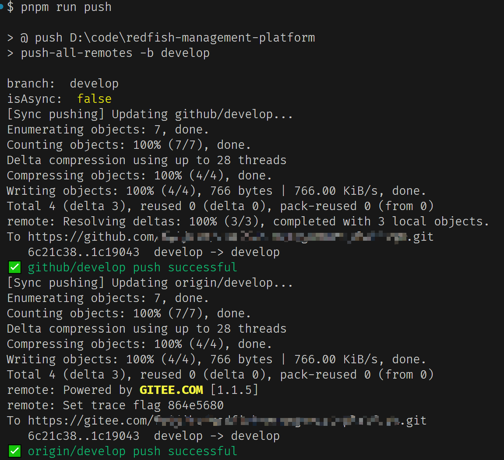

[简体中文](/README_CN.md) | English

#### Installation and Configuration

1. install package:
```bash
npm install -D push-all-remotes
```

2. add script in `package.json`:
```json
{
  "scripts": {
    "push:dev": "push-all-remotes -b develop -async",
    "push": "push-all-remotes"
  }
}
```
ensure you have configured other remote repositories:
```bash
git remote

# 输出:
# origin
# other_remote
```

you can run the script:
```bash
npm run push:dev

# git push origin develop & git push other_remote develop
```
or
```bash
npm run push # default branch is `develop`

# git push origin develop & git push other_remote develop

```
or
```bash
npm run push -- -b master -async

# git push origin master & git push other_remote master
```


| Parameter | Description |
| --- | --- |
| `--branch <branch name>` | Specify the target branch, default is `develop`. `--branch` can be replaced with `-b` |
| `-async` | Whether to push asynchronously, the default synchronization push may have mixed logs but clear result indicators |


